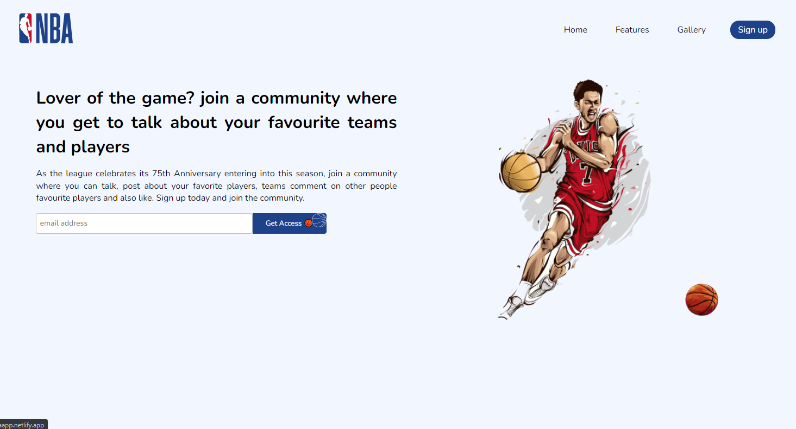
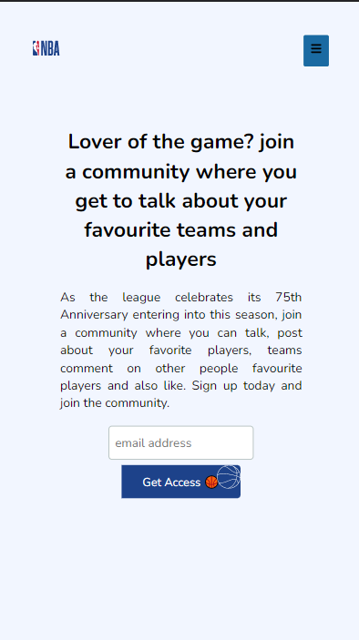
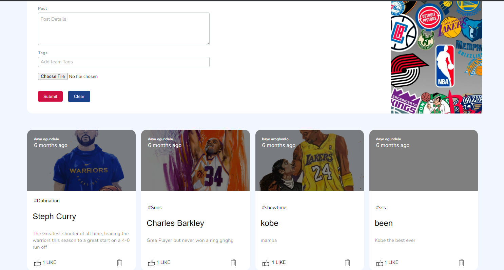

# NBA-BLOG-WEBSITE

A Blog type Website that focuses solely on the NBA, users can Signup, Login, Like and comment on posts while logged in. Backend built with Nodejs and express, users data are stored in SQL data Base (MongoDB) after signing up, User can create, Edit and delete their personal post. Post also includes Pictures of Players teams etc. Sign up and discuss about your Favourite player or team in the NBA

Frontend was created with React while backend uses Node js

App cant be launched because of the NBA blocks Heroku and some other hosting website but you can do the following to launch app on your local PC/ Machine either through cloning or downloading the file from github

- Open nba folder
- open a new terminal
- run npm install for frontend
- run npm start to run frontend development server
- cd into server (cd server) for backend
- open a new terminal
- run npm install
- run npm start to start up the node server that connects to the api

- Open [http://localhost:3000](http://localhost:3000) to view it in the browser.

## Home Desktop View

## Home Mobile View

## Blog Desktop View

## Blog Mobile View

